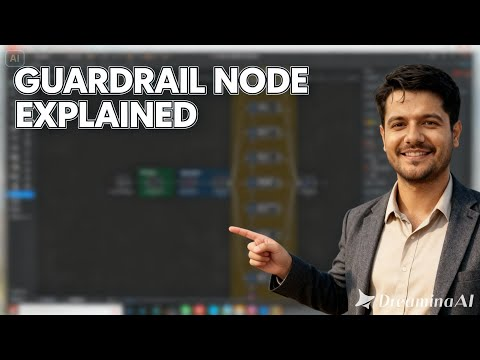

# Complete AI Safety Suite: Test 9 Guardrail Layers with Groq LLM

Advanced n8n automation for Complete AI Safety Suite: Test 9 Guardrail Layers with Groq LLM.

## Overview
- Category: Engineering, AI Summarization
- Complexity: advanced
- Source: n8n workflow template export

## What This Automation Does
Ensure content safety in your AI workflows with this n8n Guardrails test suite. Covers 9 guardrails, real test cases, and easy customization. Learn more!

## Included Files
- `workflow.json`

## Setup
1. Import `workflow.json` into n8n.
2. Configure required credentials for the services used in the workflow nodes.
3. Update any environment variables or static values inside nodes (API keys, URLs, IDs).
4. Run a test execution and then activate the workflow.

## Tech Stack

- `@n8n/n8n-nodes-langchain.guardrails`
- `@n8n/n8n-nodes-langchain.lmChatGroq`
- `n8n-nodes-base.manualTrigger`
- `n8n-nodes-base.set`
- `n8n-nodes-base.splitOut`
- `n8n-nodes-base.stickyNote`

## Author

Murtaza Baig

## Screenshots

## License
MIT License. See `LICENSE`.